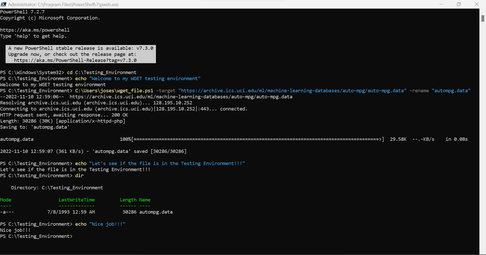

# Powershell_WGET_Retrieve_and_Rename

This program was constructed using the Windows PowerShell ISE.

wget was download for the 64xbit archetiture from this following website.

<a href="https://eternallybored.org/misc/wget/"> https://eternallybored.org/misc/wget/ </a>

After downloaded I inserted the file in the C:\Windows\System32 folder and restarted the PowerShell Session.

Using wget to download a file from the web, and rename it to a desired name.

